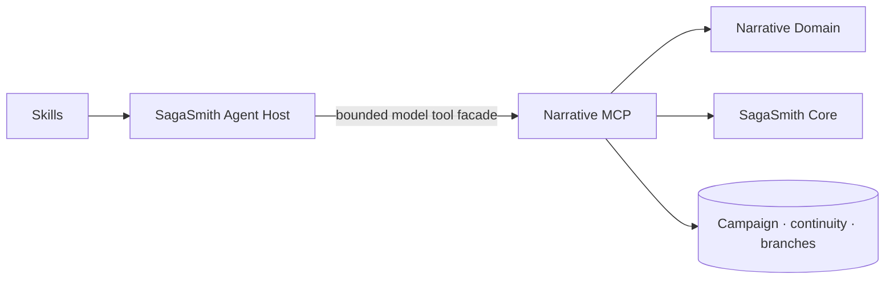

# SagaSmith Narrative

[Domain](packages/domain/README.md) · [MCP English](packages/mcp/README.md) ·
[MCP 中文](packages/mcp/README-zh.md) · [Skills](skills/README.md) ·
[Platform](https://github.com/SagaSmithAI/.github/blob/main/profile/README.md)

SagaSmith Narrative is the vertical monorepo for system-neutral long-form
tabletop narrative play. It versions deterministic declarative contracts, the
authoritative MCP server, and Agent Skills together while keeping their package
and runtime responsibilities separate. It is the system-neutral option for
long campaigns whose mechanics can be declared safely; systems with reusable,
interacting rule engines belong in their own provider repository.

## Choose a path

| Goal | Start here |
|---|---|
| Run the authoritative local server | `pip install sagasmith-narrative-mcp` then `sagasmith-narrative-mcp` |
| Define or validate declarative profiles | Read the [Domain package guide](packages/domain/README.md) |
| Connect a modern Host | Read the [MCP guide](packages/mcp/README.md) and [protocol matrix](packages/mcp/docs/protocol-compatibility.md) |
| Facilitate or author a project | Read the [Skills catalog](skills/README.md) |
| Understand profiles and Packs | Read the [profile and Pack lifecycle](packages/mcp/docs/profile-and-pack.md) |

Python 3.11+ is required.

## Repository layout

```text
packages/domain/                       declarative narrative schemas and validators
packages/mcp/                          authoritative request-scoped tool runtime
skills/                                narrative facilitation procedures
skills/narrative-project-generator/    profile and Pack authoring procedure
```

## Architecture and authority



- The Host owns the LLM, context aggregation, task planning, and the small tool
  facade exposed to the model.
- MCP is the sole authority for campaign state, per-request authorization,
  phases, revisions, idempotency, random streams, audience-filtered reads,
  private NPC workers, and atomic settlement.
- Domain owns deterministic declarative schemas and validation only. It does
  not own transport sessions, persistence, authorization, or narration.
- Skills own semantic review, fictional positioning, audience choices, NPC
  decisions, continuity procedures, and prose. They never write the database
  directly or silently fall back to a private protocol.

Long campaigns can start from a complete authored Module or from a smaller
setting-and-opening-scene seed. `continuity_query` can return a bounded,
audience-filtered four-track actor-memory context (identity, motivational,
semantic, and episodic) for NPC and PC decisions. Facilitator-private campaign
design tracks fronts, plot threads, clues, and character arcs independently of
the public scene record. When play reaches a reasonable place outside the
current Atlas, a signed expansion proposal can become a lineage-linked child
episode Pack through the normal draft, review, finalize, import, and activation
lifecycle; an authored Module therefore remains expandable without silently
rewriting its source Pack.

## Keeping the tool list accurate and small

Modern `tools/list` is the complete, deterministically sorted catalog for an
authorization/cache scope. Phase changes and tool side effects do not mutate
it. SagaSmith Hosts derive a task/role/phase/profile facade and expose at most
16 tools to the model by default. Sixteen is a SagaSmith accuracy policy, not
an MCP protocol limit.

This avoids a giant model-facing catalog without treating connection state as
authority. Optional mechanics and Conflict tools enter the Host facade only
when the active immutable profile declares them. The MCP still revalidates
identity, membership, actor/element grants, phase, branch, revision, and
operation on every call. An expiring owner-bound `exposure_handle` helps catalog
navigation but grants no permission.

## MCP 2026-07-28

The modern path follows MCP 2026-07-28 request semantics:

- no `initialize`, hidden protocol session, or `Mcp-Session-Id` authority;
- protocol version, capabilities, trace context, and target-specific
  `sagasmith.auth-context/v2` delegation on every request;
- optional `server/discover` and modern HTTP method/name routing;
- identical handler, schema, error, and authority behavior over stdio and
  Streamable HTTP;
- explicit campaign/branch/revision parameters and owner/TTL server handles for
  cross-call work;
- repairable tool failures as `isError: true` structured errors, while unknown
  methods/tools and invalid requests remain JSON-RPC protocol errors.

The initialized/session adapter remains only for explicit migration and
rollback. Its exposure and `tools/list_changed` behavior are not a durable
security boundary.

This repository is the current source of truth for every Narrative component
listed above. The former standalone MCP, Skills, and generic Module Generator
repositories are archived read-only; current issues, releases, integrations,
and documentation belong here.

## Run locally or over HTTP

The text-only local server starts on stdio:

```bash
pip install sagasmith-narrative-mcp
sagasmith-narrative-mcp
```

Loopback Streamable HTTP uses the same handlers:

```powershell
$env:SAGASMITH_NARRATIVE_MCP_TRANSPORT = "streamable-http"
$env:SAGASMITH_NARRATIVE_MCP_HTTP_HOST = "127.0.0.1"
$env:SAGASMITH_NARRATIVE_MCP_HTTP_PORT = "8770"
sagasmith-narrative-mcp
```

Non-loopback HTTP requires `SAGASMITH_AUTH_CONTEXT_SECRET` and a dedicated,
audience-scoped Host delegation on every request. Browser or unrelated-audience
tokens must never be passed through. HTTP sockets may be pooled, but principal,
campaign, exposure, and authorization state may not be.

## Verified integration baseline

The hosted boundary targets MCP 2026-07-28. The Agent supplies a short-lived,
audience-scoped `sagasmith.auth-context/v2` delegation on every request; the
server never trusts model-selected identity or connection state. Local Agent Kit
clients may use stdio or Streamable HTTP through the same handlers. A legacy
initialized/session adapter remains during migration and is not an authority
boundary. Real-Agent integration coverage calls the public MCP
facade rather than fabricated internal results. The current contract suite adds
modern/legacy × stdio/HTTP parity, deterministic catalog/private-cache checks,
ten independently solved read-only evaluations, and three self-authored full
campaign fixtures. The 2026-08-20 rebuilt hosted stack also ran the D&D and CoC
reference regressions concurrently; that result validates composition and
startup, not a complete Narrative project playthrough.

## Development

```bash
uv sync --all-packages --all-extras
uv run --no-sync ruff check packages/domain packages/mcp
uv run --no-sync pytest packages/domain/tests
uv run --no-sync pytest packages/mcp/tests
```

Run the three real-stdio campaign fixtures concurrently:

```bash
uv run --no-sync python packages/mcp/scripts/regression_parallel_campaigns.py --output .runs/parallel
```

Validation covers authorization and private cache isolation, stable schemas and
structured errors, trace propagation, bounded list/search pagination,
idempotency, stale revisions, concurrency, restart recovery, branches, private
NPC dialogue, and alternate endings. Fixtures are original and do not require
production data, paid models, or external services.

## Deploy, upgrade, and roll back

Deploy the compatible component set in order: Core auth-context v2, the dual-era
Agent, then this MCP/Domain revision and its Host lock. The server applies the
current Core migrations at startup. Before schema changes, stop writers and
take a consistent backup after the SQLite WAL settles, or use the external
database's native backup.

Protocol rollback selects the documented legacy adapter. Data rollback restores
the database with its matching Core and MCP versions; never downgrade the SDK
alone while a Host still sends modern request semantics. See the
[compatibility runbook](packages/mcp/docs/protocol-compatibility.md).

An application UI may be added later under `apps/ui`; no placeholder runtime or
fallback protocol is shipped today. Original code, Skills, and the included
fixture worlds are Apache-2.0. Import third-party material only when you have the
rights to use and distribute it.
